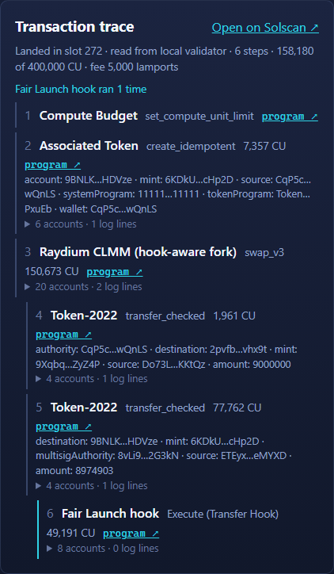

# The Fair Launch reference UI

A small web app that swaps a hooked token on a hook-aware Raydium deployment and shows the hook
allow or refuse the trade. It is a reference and a pattern to copy, not the Raydium app, and it
talks only to **our** experimental devnet deployment (and, for the browser tests and development, a local
validator), never to
Raydium's.

```text
packages/transfer-hook-client   the hook-aware client (Apache-2.0, no Raydium SDK)
apps/fair-launch-ui             the React app (GPL-3.0-or-later, because it uses Raydium SDK V2)
```

## What it proves

* A browser can resolve each swap leg's Transfer Hook accounts (with the SPL JavaScript helper, not
  a reimplementation), build `swap_base_input_v2` or `swap_v3`, simulate it, and only then ask a
  wallet to sign.
* A buy inside the launch limits succeeds, and an over-limit buy is refused **by the hook** during the
  simulation, shown as words ("Your wallet balance would exceed the configured launch limit"), with
  nothing submitted and no balance changed.
* A sell is not treated as a buy: the Fair Launch rules bind only transfers out of a launch venue.
* The same shell works for CPMM and CLMM pools (the adapter is chosen from the pool's owner program)
  and, by swapping the policy panel, for the other examples.

The browser test in [`apps/fair-launch-ui/e2e`](../apps/fair-launch-ui/e2e) runs exactly this against a
local validator, for a CPMM and a CLMM pool: one passing buy, one hook-refused buy, one sell. The same shell
carries a policy panel for each of the three example hooks, and the browser test covers all three (16 tests):

| Hook | Panel | What the browser test does |
|---|---|---|
| Fair Launch | the launch window, meters for each limit, buy-only rules | a buy inside the limits, an over-limit buy refused by the hook, a sell |
| Creator Commitment | the vesting schedule, the amount still locked, and whether the connected wallet is the creator account | a sale that would leave the account below the locked amount is refused by the hook (shown in words, nothing submitted); a sale that leaves it above goes through; buying is never restricted |
| Holder Rewards | the stream, whether the wallet is registered, what it has earned and can claim | Register, wait for the stream to accrue, Claim into the wallet, then a swap that carries the reward accounts |

The panel decides nothing: the hook does. The creator-commitment and holder-rewards decoders and their
vesting and reward arithmetic are TypeScript in `packages/transfer-hook-client`, checked against fixtures
the Rust hook programs write (`tests/fixtures/typescript`), so a change to the on-chain layout or arithmetic
fails the TypeScript tests.

## Run it on a local validator

```sh
npm install
cargo xtask localnet build                    # the pinned Raydium forks and this repo's hooks
cargo xtask localnet validator                # leave running; in another terminal:
cargo xtask localnet ui-fixture --wallet <YOUR_WALLET_PUBKEY> --out target/ui-e2e/fixture.json
# or --hook creator-commitment | holder-rewards, and --amm clmm
npm run ui:dev
```

`ui-fixture` creates a Fair Launch pool (100 tokens per buy, 300 per account, three buys per slot, a
one-hour window) and gives the wallet SOL and both tokens. Open
`http://127.0.0.1:5173/?env=localnet&pool=<pool from fixture.json>` and connect Phantom or Solflare
pointed at `http://127.0.0.1:8899`. `?env=devnet` selects our integration devnet deployment.

The browser test (`npm run ui:e2e`) starts the validator itself if none is running, so a developer needs only
the built programs. It can also run against our integration devnet (`E2E_ENV=devnet npm run ui:e2e`): that
needs the deployer key in `.keys/` (pool creation is admin-only) and a fraction of a SOL, and it was run
that way once; the deterministic CI run uses the local validator only.

The page is a devnet page: it shows a "Devnet" label and has no environment switch. A local validator is reached
only by opening the page with `?env=localnet`, which is how the browser tests and local development use it. There is no
official-Raydium mode: Raydium's
own programs do not contain the hook-aware instructions.

## How the Raydium SDK is used, and why the swap is built separately

[`@raydium-io/raydium-sdk-v2`](https://www.npmjs.com/package/@raydium-io/raydium-sdk-v2) (pinned) is
used for what it is good at: reading pool and config accounts (`getRpcPoolInfo`, `getPoolInfoFromRpc`)
and the quote math (`CurveCalculator`, `PoolUtils.computeAmountOut`). Its swap builders are **not**
used: they emit the stock `swap_base_input` / `swap_v2`, which do not know the `_v2` / `swap_v3`
instructions or their hook-account counts. The client builds those:

| | |
|---|---|
| per leg | the mint's TransferHook extension decides whether there is a hook; the validation list decides the extras |
| slice | `extras…, hook program, validation list` (empty if the leg has no hook), never merged, sorted or deduplicated |
| CPMM | the 13 fixed accounts, then the input leg's slice, then the output leg's; data = V1 data with the new discriminator and two `u16` counts |
| CLMM | the 13 fixed accounts, tick arrays, the optional bitmap extension, then the two slices; four `u16` counts |
| checks | extras never sign, are writable only if the caller named them, may not escalate a fixed account; the hook program must be the expected one |

The client's output is checked byte for byte against the Rust crate's committed golden files
(`crates/transfer-hook-sdk/tests/golden`), so the two languages cannot drift apart unnoticed.

## The swap button, in order

Reload the pool and the launch state, quote, read each leg's hook, resolve both slices, build the
hook-aware instruction, compile a v0 transaction, **simulate**, and only if that passes ask the wallet to
sign, then send and confirm and refresh. The reference app uses v0 transactions because the Fair Launch
priority-fee rule reads `SetComputeUnitPrice`, which is unreliable on v1 transactions.

## Pointing it at a pool

`?pool=<address>`. The page fails closed unless the pool is owned by the environment's Raydium program,
is open for swaps and, when the pool holds a Fair Launch token, the pool's vault of that token is one of
the launch's venues. A hooked mint you have not seen before is shown in full with its hook program and
must be confirmed once (the mint address is the identity, never the symbol).

## Reading the Fair Launch panel

Each limit that is switched on is a meter (a limit of `0` is off and not shown). For a buy the meters show
what this trade would use: buy size, the wallet's balance after the buy, buys in the current slot, and the
declared priority fee. A meter turns red and a warning appears before signing when the trade would break a
rule. The warning is advisory: the Swap button stays enabled so the simulation, which runs the real hook,
has the last word. Outside the window the panel says so and shows no meters.

Above the meters the panel says, in words, what the launch enforces: the per-buy size, the wallet cap, the buys-per-slot limit
("a bundle with more is refused as a whole", the anti-bundle rule), the priority-fee limit (anti-snipe), and that selling is
never restricted. Two buttons, **A buy inside the limits** and **A buy over the limit**, fill the swap box so you can press Swap and
see the hook allow or refuse it. Which rules show is read from the launch's own config account, so a limit set to 0 does not appear.

## Making a pool: demo pools and your own token

Under the search bar of the home page there are two buttons.

* **Create a demo pool.** Choose a hook (Fair Launch, Creator Commitment or Holder Rewards) and an AMM (CPMM or CLMM). The dev server runs
  this repository's own pool command (`raydium-hook ui-fixture`, or `cargo xtask localnet ui-fixture` for a local validator) and
  makes a new hooked token and a real pool of our forked Raydium, gives the connected wallet test tokens, and the page opens the pool when
  it is done (about 20 seconds on a local validator, a minute or two on devnet). One pool at a time and one a minute per cluster.
  It needs the pool admin's key, so it appears only where the dev server has it: `FAUCET_KEYPAIR` in `apps/fair-launch-ui/.env.local` for
  devnet (and `.keys/cpmm-fee-receiver.json`), the committed fixture admin and a running validator for local. A devnet pool spends devnet SOL
  from that key. Elsewhere the panel says what it needs.
* **Bring your own token.** Paste a mint and the page reads whether it is a token, whether it has a Transfer Hook, and whether the pool
  admin has approved it on CPMM and on CLMM (the approval record the admin's `raydium-hook mint approve` leaves behind). It prints the
  commands that come next with your environment filled in (`mint approve`, `mint approval`), and the command that builds a token and a pool
  around a hook program of your own: `raydium-hook e2e --hook-dir ./your-hook --keep-state pool.json`. It sends nothing.

Why this is a developer-side tool: our forked Raydium refuses to create a pool containing a hooked token until the pool admin has
approved that token, and only the admin key can. A browser wallet cannot give that approval, so a pool for your own token needs the admin
(on our devnet that is the deployer key) whatever the page does. The tools also make the token and the pool together; there is no
command that creates a pool around a token you already hold, so "bring your own" is "bring your own hook", and the pasted-mint check is for
reading where it stands.

## Connecting a wallet

**Connect wallet** opens a dialog that lists the wallets with their own logos (the wallets' own icons): Phantom and Solflare by name,
and any other Wallet Standard extension the browser has, such as Backpack. A wallet the browser has is marked Detected and is one
click (select and connect together); one it does not have is marked Install and opens its install page.

**Use the real wallets on the devnet page.** The adapter tells Solflare the page is on Devnet (Solflare compares that with the network
chosen in the wallet and refuses to sign on a mismatch: "this transaction is for mainnet"). A local validator is not one of Solflare's
networks, so a transaction for it is reported as mainnet whatever the wallet is set to. For the local validator (`?env=localnet`,
used by the browser tests) use the test wallet, which a `VITE_E2E=1` build adds.

Every token, program and account on the page (the token chips, the policy panels, Developer details, each trace step) is a Solscan link on
the page's cluster.

## Getting tokens into a wallet

A wallet needs some of the pool's tokens (and SOL, for fees) before it can swap. **Developer details has a "Your tokens"
line that says what the wallet holds before you click anything**, and, when it holds none of the pool's tokens, what to do
about it. There are three ways to get tokens, and none puts a key in the browser:

* **You made the token: "Mint 100 to my wallet".** If the connected wallet is the mint authority of a token in the pool, the
  page builds the mint, simulates it, and your wallet signs it. This is how the creator of any custom hooked token funds
  themselves; no server is involved.
* **Our demo tokens: "Get test tokens".** The dev server mints 100 of each demo token into the wallet with the key that
  created them (`FAUCET_KEYPAIR` in `apps/fair-launch-ui/.env.local`; a local validator uses the committed fixture admin). It
  only answers this machine, once every few seconds per wallet, and a static build has no such route. It mints only tokens whose
  mint authority is that key; for any other token it says why it skipped it.
* **From a terminal:** `npm --workspace apps/fair-launch-ui run fund -- <WALLET> --pool <POOL> --cluster devnet` does the
  same as the server button (`--mint <MINT>` instead of `--pool` names the tokens directly).

A trader who is not the mint authority gets a launch's tokens by buying them in the pool, which is the point of the page. A
token whose mint authority has been given up (Holder Rewards does that) cannot be minted by anyone.

A swap from a wallet with no SOL on the network says "Your wallet has no SOL on this network" (the runtime's own
`AccountNotFound`), not the raw error; nothing is submitted.

## Transaction trace (Triton One, Solscan)

After a swap (or a Register / Claim) lands, the page shows a **Transaction trace** card: every program the
transaction ran, in the order the runtime ran them and nested as they called each other, each with its compute, its
accounts and its logs.



For a hooked CLMM swap on devnet it reads:

```text
1  Compute Budget                    set_compute_unit_limit
2  Raydium CLMM (hook-aware fork)    swap_v3                  109,176 CU
3    Token-2022                      transfer_checked          34,473 CU   amount: 10
4      Transfer Hook Cz3G…Q11X       Execute (Transfer Hook)   16,643 CU
5    Token-2022                      transfer_checked           1,911 CU
Transfer Hook Cz3G…Q11X ran 1 time
```

On the hook's own step the card names **what the hook enforced on that transfer**: for Fair Launch the max buy, the wallet cap, the
buys per slot, the priority fee and the launch window, each with this transaction's number against the limit and a tick, and for a refused
transaction the rule the hook broke (from the error it returned). Creator Commitment says whether the vesting floor applied (the transfer was
out of the creator account) and Holder Rewards that it updated the reward records. The hook program itself only says `Execute`; the rules come
from its config account, which the page has already read (`src/lib/hook-rules.ts`).

Each step links its program to Solscan, every account it named is a Solscan link, and the card links the transaction.
All links to the chain on this page go to Solscan (devnet with `?cluster=devnet`; a local validator through Solscan's
custom-RPC mode).

**It is standalone: this app reads the transaction itself.** The page calls `getTransaction` (`jsonParsed`) and rebuilds
the call tree from the runtime's log lines: the n-th program invocation in the logs is the n-th instruction in the
transaction's outer-then-inner instruction list, and the `invoke [depth]` lines give the nesting. The idea is the one
`raydium_debugger` uses for its execution tree; no code or server from that project is needed (`src/lib/trace.ts`).

**Our Triton One endpoint** goes in `apps/fair-launch-ui/.env.local`, which is git-ignored (copy
[`.env.example`](../apps/fair-launch-ui/.env.example)):

```sh
TRITON_DEVNET_RPC_URL=https://<your-endpoint>.devnet.rpcpool.com/<x-token>
```

The Vite dev server (and `vite preview`) forwards `/triton/devnet` to that URL on the server side, token and all.
The variable has no `VITE_` prefix on purpose, so Vite never copies it into the page, and **the browser never holds the
URL**. Without it the card reads devnet through the public devnet RPC, and a local validator is read from its own RPC. A
static build served without the dev server has no proxy, so it uses the public RPC; put a server-side proxy in front
of Triton if you deploy it.

The card says where it read from ("Triton One (devnet)", "public devnet RPC" or "local validator"). A fresh signature can
take a moment to reach the RPC, so the page asks up to six times before it reports that it has not seen it.

The decoding is limited to what is in the transaction: Token-2022 and System instructions arrive decoded, our programs'
instructions are named by their discriminators (the swaps, the hook's `Execute`, the holder-rewards Register and Claim),
and anything else shows its program and logs only. Other things Triton offers could improve it, notably browser
WebSockets for live status and its priority-fee percentiles; neither is built.

The trace is covered by unit tests against a real `getTransaction` answer from our Triton devnet endpoint
(`test/data/clmm-swap.json`) and by a browser test that swaps and checks the steps, the hook run count and the links, on a
local validator in CI and, with `E2E_ENV=devnet`, on devnet through Triton.

## Copying the pattern for another hook

Keep `packages/transfer-hook-client` and the transaction layer (`src/lib/swap.ts`, `run-swap.ts`) and
replace the policy panel (`FairLaunchPolicy`) and its decoder (`packages/transfer-hook-client/src/fair-launch`)
with your hook's state and error codes. Creator Commitment needs the creator account, the locked total and
the vesting progress; Holder Rewards adds registered / earned / claimable and Register and Claim buttons
(those are ordinary instructions of the hook program, not part of the swap).

## Limits

* Our experimental devnet deployment only (plus a local validator by `?env=localnet`); no mainnet and no official Raydium.
* CPMM and CLMM exact-input swaps. Exact-output swaps and liquidity operations are not in the UI.
* Wrapped SOL is not handled; use two SPL tokens.
* Only the three example hooks (fair-launch, creator-commitment, holder-rewards) have a decoder and a panel.
  Another hook's errors are reported as "Transfer Hook rejected this transaction" with the raw code, never
  guessed.
* The creator-commitment and holder-rewards panels are covered by the browser test on a CPMM pool on the local
  validator only (the fair-launch panel on CPMM and CLMM, and on integration devnet); the TypeScript logic of
  the other two is checked against the Rust fixtures for either AMM.
* The test wallet used by the browser test exists only in builds made with `VITE_E2E=1`; normal builds
  contain no key handling. The app has no backend and holds no secrets.
* Licence: the client package is Apache-2.0 like the Rust crates; the app is GPL-3.0-or-later because it
  links Raydium SDK V2 (GPL-3.0). Do not copy SDK source into this repository's Rust crates.
